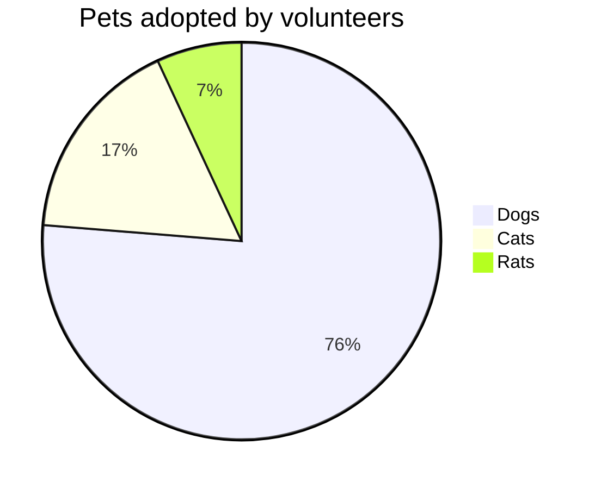

## Titles
---
# H1 - heading

checking things out in this testing blog. :)

Here's some **bold** text.

What about a [link](https://github.com/dataoptimal)


Here's a bulleted list:
* First item
+ Second item
- Third item

Here's a numbered list:
1. First
2. Second
3. Third

Python code block:
```python
    import numpy as np

    def test_function(x, y):
      z = np.sum(x,y)
      return z

      # comments
```

R code block:
```r

    library(tidyverse)
    df <- read_csv("some_file.csv")
    head(df)


```

```c++

#include <iostream>
using namespace std;

// main() is where program execution begins.
int main() {
   cout << "Hello World"; // prints Hello World
   return 0;
}

```


The youtube video cam be embedded in the jekyll website as follows:


The following is implemented using jekyll plugin from:

https://github.com/planetjekyll/awesome-jekyll-plugins


From this the jekyll-youtube gem is used from:
https://github.com/dommmel/jekyll-youtube


https://www.youtube.com/watch?v=wCOInE7-E0I
https://www.youtube.com/watch?v=ho8-vK0L1_8


$ 2^{\frac{n-1}{3}} $


$ \int\_a^b f(x)\,dx. $

```plantuml!
Bob -> Alice : hello world
```



\1. List item Apple.
\3. List item Banana.
\10. List item Cafe.

|--|--|--|--|--|--|--|--|
|♜| |♝|♛|♚|♝|♞|♜|
| |♟|♟|♟| |♟|♟|♟|
|♟| |♞| | | | | |
| |♗| | |♟| | | |
| | | | |♙| | | |
| | | | | |♘| | |
|♙|♙|♙|♙| |♙|♙|♙|
|♖|♘|♗|♕|♔| | |♖|


| :    Easy Multiline   : |||
| :----- | :----- | :------ |
| Apple  | Banana | Orange  \
| Apple  | Banana | Orange  \
| Apple  | Banana | Orange
| Apple  | Banana | Orange  \
| Apple  | Banana | Orange  |
| Apple  | Banana | Orange  |


$ a * b = c ^ b $

@startuml
Bob -> Alice : hello
@enduml

 


